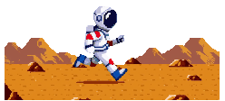

# ᛒᛚᚢᛒ - pixelNodepack + workflow

*by ランラン - ᛒᛚᚢᛒ -Zeppelins or Bust*

**blubs pixel nodes** — a ComfyUI custom node pack that turns **MiniMax H3** video
output into real, game-ready **pixel-art sprite animations**: palette-locked frames,
keyed alpha, anchored crops, loop trimming, sprite sheets, GIFs, and a headless
**Aseprite bridge**. Run it as individual nodes, as 2-node Easy mode, or as the
**ᛒᛚᚢᛒ Super Pixel Forge** — an all-in-one workspace node with its own canvas,
stage previews, and timeline. Fully self-contained and **non-destructive**: adds one
folder under `custom_nodes/`, modifies nothing else, and depends only on
`torch` / `numpy` / `PIL` (already in the ComfyUI venv).

> ⚠️ **Public test build.** The core sprite pipeline (gen → key → quantize → crop →
> loop → sheet → GIF) is stable and ready for testing, and the **ᛒᛚᚢᛒ Super Pixel
> Forge / One Forge workspace nodes** are the new flagship way to run it — they're
> fresh, so UI rough edges are expected. The **Aseprite export/bridge
> nodes are still being finished** — PNG sequence + `frames.json` export works, but
> the headless `.aseprite` build and the Aseprite-side extension are experimental.
> Everything degrades gracefully: no Aseprite → PNGs + JSON only, nothing breaks.

## Example generations

| | | |
|---|---|---|
|  |  |  |
|  |  | |

## Install

1. **Clone into ComfyUI's custom_nodes folder:**

   ```
   cd ComfyUI/custom_nodes
   git clone https://github.com/japaneserunic/blubs-pixel-nodepack.git
   ```

   (Or download ZIP → extract → the folder must sit at
   `ComfyUI/custom_nodes/blubs-pixel-nodepack/`.)

2. **Python deps:** none beyond ComfyUI's own (`torch`, `numpy`, `Pillow`).
   If you want to be explicit: `pip install -r requirements.txt` inside your
   ComfyUI venv.

3. **Restart ComfyUI.** Nodes appear under the `PixelForge/*` category (Easy
   variants under `PixelForge/Easy`). The workspace UI (`web/js/pf_studio.js`)
   loads automatically with the frontend — no extra step.

## Requirements (for the bundled v7 workflow)

The **node pack itself has zero hard dependencies** — every `PixelForge/*` node runs
standalone. The bundled **workflow** additionally uses MiniMax H3 model nodes from
these public packs (install via git clone or ComfyUI Manager):

| Pack | Repo | Used for |
|---|---|---|
| ComfyUI-MiniMax-H3-Turbo | https://github.com/Larryvrh/ComfyUI-MiniMax-H3-Turbo | `MiniMaxH3ImageToVideo`, turbo LoRA loader, 4-step turbo sampler |
| ComfyUI-MiniMaxH3-Director | https://github.com/seesee75-commits/ComfyUI-MiniMaxH3-Director | H3 chain / director nodes |
| ComfyUI-Spectrum-MiniMax-H3 | https://github.com/xmarre/ComfyUI-Spectrum-MiniMax-H3 | `SpectrumApplyMiniMaxH3` |
| ComfyUI-KJNodes | https://github.com/kijai/ComfyUI-KJNodes | utility nodes |
| ComfyUI-Manager (recommended) | https://github.com/ltdrdata/ComfyUI-Manager | **Install Missing Custom Nodes** resolves any remaining utility nodes (`ComfyMathExpression`, `PrimitiveFloat`, `ResolutionSelector`, …) automatically |

**Model files** (put them in the matching `ComfyUI/models/` subfolders — the workflow
is pre-set to these filenames):

| File | Folder |
|---|---|
| `minimax_h3_fl2va_pruned_int8_convrot.safetensors` | `models/unet` (or `diffusion_models`) |
| `minimax_h3_fl2v_lightx2v_turbo_4step_v0.1_comfy_resized_avg_rank_21_bf16.safetensors` | `models/loras` |
| `qwen3vl_32b_heretic_minimax_h3_nvfp4.safetensors` | `models/clip` (or `text_encoders`) |
| `minimax_h3_video_vae_fp16.safetensors` | `models/vae` |
| `minimax_h3_audio_vae_fp32.safetensors` | `models/vae` |

Grab them from the same place you got your MiniMax H3 setup (see the H3 pack READMEs
above for download links). Any H3-compatible checkpoint works — just reselect it in
the loader nodes.

**Workflows:** drag [`example_workflows/pixelforge_h3_super_forge.json`](example_workflows/pixelforge_h3_super_forge.json)
into ComfyUI — the **ᛒᛚᚢᛒ Super Pixel Forge**: the whole forge pipeline inside a
single workspace-node UI (canvas, stage tabs, timeline — see the suite section
below). Want the ENTIRE workflow as one node (loaders + sampling + forge +
export, zero wires)? Use
[`example_workflows/pixelforge_h3_one_forge.json`](example_workflows/pixelforge_h3_one_forge.json).
If anything is missing, use *Manager → Install Missing Custom Nodes*.
Classic builds: `pixelforge_h3_sprite_easy_v2.json` (Easy v2 — same H3 gen side,
post chain condensed into 2 nodes) and `pixelforge_h3_sprite_v7.json`
(every knob exposed, full control). Companion workflows:
`pixelforge_h3_sprite_still_v2.json` (single sprite) and
`pixelforge_h3_sprite_edit_v2.json` (edit an existing sprite via ref2va).

**De-rope variant:** `pixelforge_h3_derope_v1.json` takes a clip you've *already
generated* and re-renders its fast-motion smear sharp before pixelizing
(H3 collapses fast poses into one latent token = mushy limbs at sprite res).
Requires [ComfyUI-MAINodes](https://github.com/matlowai/ComfyUI-MAINodes)
(Motion Lab) and [ComfyUI-KJNodes](https://github.com/kijai/ComfyUI-KJNodes)
alongside this pack. Point LoadVideo at your clip, match the aspect in the
Resolution Selector, describe the clip in the prompt (keep the sharpness
clause), queue.

**De-rope T2V variant:** `pixelforge_h3_derope_t2v_v1.json` is the one-queue
production flow: prompt -> baseline gen -> oracle -> re-denoise -> recover ->
sprite. Same MAINodes/KJNodes dependency; write your prompt in BOTH
MiniMaxH3ImageToVideo nodes (pass 1 + pass 2 must match).

## The pipeline

```
H3 (MiniMaxH3ImageToVideo / Director chain)
  -> KSampler -> VAEDecode (video VAE)          [IMAGE batch @24fps]
  -> H3 Frame Decimate        (24 -> 12 fps, sprite timing; every_nth=1 keeps all)
  -> Pixel Grid Recover       (recover the TRUE art grid H3 rendered)
  -> Temporal Stabilize       (crawl killer — stops pixel creep across frames)
  -> Sprite Chroma Key        (flood: border-connected Lab removal, shadow-proof)
  -> Pixel Art Quantize       (premultiplied downscale = zero backdrop bleed;
                               k-means palette from sprite pixels only)
  -> Sprite Auto-Crop & Anchor(union bbox, bottom-center anchor, no jitter)
  -> Sprite Loop Trim         (auto loop-point search / ping-pong / off)
  -> Sprite Frame Dedup       (drop duplicate holds -> durations_json)
  -> Sprite Sheet Pack        (grid sheet + Aseprite JSON-hash)
  -> Aseprite Export          (PNG seq + frames.json + .aseprite + sheet) [WIP]
  -> Save Sprite GIF          (shared exact palette, transparency, in-app preview)
```

**Order matters: grid recover & stabilize BEFORE key, and key BEFORE quantize.**
Keying at full res gives a clean silhouette; the quantize node's premultiplied
downscale then keeps backdrop color out of the sprite's edge pixels entirely.

## ✨ Easy mode (v2) — the whole pipeline in 3 nodes

Category `PixelForge/Easy`. Plain-language presets over the exact same engines
(grid recover → motion fix → chroma key → quantize/TruePixel → crop → loop →
dedup) — **zero copied code**, so fixes to the original nodes flow through
automatically. The full node set is untouched; both coexist.

- **✨ Sprite Studio (Easy v2)** — frames in, game-ready sprite run out, ONE node:
  - **Sprite size** — **Source (H3's own grid)** keeps the exact art grid H3
    rendered: 1:1, crispest, the default. Tiny 16 / Small 32 / Medium 64 /
    Large 128 / Huge 256 / Custom only when you need fixed game-ready dims.
  - **Look** — Modern / Retro 16-bit / Hardcore 8-bit / Hi-bit cel shading / Hi-bit clean
  - **Palette** — auto from sprite, any built-in retro palette, or custom image +
    a simple "how many colors" slider
  - **Dither** — Off / Light / Medium / Strong · **Cleanup** — one 0–3 slider
  - **Background** — auto-detect / green / blue / magenta / black / white / custom hex,
    with Gentle / Normal / Aggressive strength
  - **Motion fix (crawl killer)** — Off / Light / Strong
  - **Loop** — Auto seamless / Ping-pong / Keep all frames, dedup toggle, anchor pick
- **📦 Sprite Export (Easy v2)** — GIF (1x/2x/4x/8x preview size), sprite sheet,
  optional Aseprite build. Set a name, hit run.
- **💬 H3 Sprite Prompt (Easy v2)** — 4 fields: character, action, style, seconds.
  Wire `h3_prompt` + `length_frames` straight into `MiniMaxH3ImageToVideo`.

Bundled as `example_workflows/pixelforge_h3_sprite_easy_v2.json`.

## 🛡️ The suite — ᛒᛚᚢᛒ Super Pixel Forge & One Forge

Two flagship nodes that wrap the stack in a **full workspace UI, inside one
ComfyUI node**: a pixel-perfect canvas with zoom/pan/onion-skin, **stage tabs
that preview the frames after every pipeline stage** (source → keyed → grid →
look → motion → final), a transport with fps playback, and a frame timeline
with thumbnails and scrubbing. The interface resizes with the node frame and
persists its state in the workflow. All processing stays on the same engines
as the individual nodes — zero copied code, non-destructive.

- **ᛒᛚᚢᛒ PIXEL FORGE** (`PixelForgeSuperForge`) — wire any decoded H3 batch in
  and forge it. Every Easy knob plus all advanced engine params, grouped so the
  main knobs stay obvious. The stage previews are the direct answer to "why
  does the processed sprite look worse than the raw H3 video?" — you see
  exactly which stage loses the quality.
  Example: `example_workflows/pixelforge_h3_super_forge.json`.
- **ᛒᛚᚢᛒ ONE FORGE** (`PixelForgeOneForge`) — the entire workflow collapsed
  into ONE node: model loaders, attention/FFN patches, turbo LoRA, prompt
  builder, **ref2va conditioning**, sampling, VAE decode, the full forge
  pipeline, and GIF/sheet/aseprite export. Suite UI is tabbed:
  ⚡ Generate (prompt / references / resolution / models / sampling / speed) ·
  🎨 Forge · 📦 Export. Optional sockets are the only pins: `images` (bypass
  generation, forge an existing batch), `first_frame` + `ref_image_2`
  (reference pictures — become `<Picture 1>` / `<Picture 2>`, tags
  auto-appended to the prompt), `alpha`, `custom_palette_image`.
  Example: `example_workflows/pixelforge_h3_one_forge.json` — one node, zero
  wires.

  Reference notes: conditioning runs through `MiniMaxH3ReferenceToVideo` —
  nothing wired = plain t2v; refs wired = reference-anchored gen.
  `ref_image_size`: `match` scales refs to the gen size (fast); `max` keeps
  refs at 2048px for best identity fidelity (several times slower). Reference
  anchoring needs a ref2va-capable checkpoint (e.g. a hybrid fl2va+ref2va
  build) — plain t2v works on any H3 checkpoint. On cores that predate the
  ref2va node, One Forge falls back to `MiniMaxH3ImageToVideo` automatically.
  Audio refs are intentionally not exposed — the sprite pipeline is silent.

**Roadmap:** the suite is growing into an Aseprite-level editor — layers,
keyframes, compositing, canvas draw tools, surgical regeneration. Dev
checklists live in [`docs/`](docs) (`SUPER_FORGE_V3_CHECKLIST.md`,
`ONEFORGE.md`).

## Nodes (category `PixelForge/*`)

### H3 integration
- **H3 Sprite Prompt** — sprite-tuned prompt for H3's Qwen3-VL encoder: style presets
  (SNES/NES/GBA/1-bit/CPS2/hi-bit), view, flat keyable background, static-camera and
  seamless-loop hints. Outputs `length_frames` snapped to H3's **17k+5 grid @24fps** —
  wire straight into `EmptyMiniMaxH3LatentAV` / `MiniMaxH3ImageToVideo.length`.
- **H3 Single Sprite Prompt** — still-sprite variant: a 5-frame (minimal grid) static
  hold. Pair with **Extract Single Frame**.
- **H3 Sprite Edit Prompt** — ref2va edit mode: "edit `<Picture 1>`" instructions that
  lock character/pose/style/palette and change only what you ask. Feed the source
  sprite through **H3 Prep Sprite For Edit** into `MiniMaxH3ReferenceToVideo.ref_image_0`.
- **H3 Prep Sprite For Edit** — nearest-upscales a tiny sprite to a valid H3 canvas
  (multiple of 32) and pads with a keyable flat color; outputs matching width/height.
- **Extract Single Frame** — grab frame N (default 0) from a decoded batch.
- **H3 Frame Grid Snap** — seconds ↔ H3 frame-grid math utility.
- **H3 Video To Sprite Frames** — `VIDEO` → IMAGE batch with decimation.
- **H3 Frame Decimate** — same for IMAGE batches straight off `VAEDecode`.

### Pixel art core
- **Pixel Art Quantize** (v2 engine) — pre-boost (saturation/contrast/unsharp),
  downscale to true pixel resolution, **k-means++ palette sampled across the whole
  batch** (or PICO-8 / NES / GAMEBOY / ENDESGA-32 / SWEETIE-16 / CGA / 1-bit / custom
  palettes), **perceptual CIELAB color mapping**, Bayer 2/4/8 or Floyd–Steinberg
  dithering, **despeckle** (orphan-pixel cleanup — the pass that makes output read as
  hand-placed pixel art), nearest upscale back to display size. Style presets:
  `modern_hibit`, `retro_16bit`, `hardcore_8bit`, `custom`. Batch-shared palette keeps
  animation colors temporally stable.
- **Sprite Chroma Key** — `flood` method: border-connected background removal in Lab
  space keyed on **hue angle** (shadow-invariant); `shadow_tolerance` controls how dark
  the backdrop may get. Hard 1-bit alpha by default (correct for pixel art); `key`
  method keeps legacy global-distance behavior. Despill tames color bleed.
- **Sprite Auto-Crop & Anchor** — union or per-frame bbox, bottom-center/center anchor,
  padding, size snapping, nearest resize → jitter-free uniform frames.
- **Sprite Loop Trim** — auto: scans the tail for the frame closest to frame 0 and cuts
  the loop; ping-pong: appends reversed frames for a guaranteed seamless loop.
- **Sprite Frame Dedup** — merges consecutive look-alikes and emits `durations_json`.
- **Sprite Sheet Pack** — uniform grid packing + **Aseprite JSON-hash** metadata
  (with real per-frame durations when dedup is wired in).

### Grid recovery
- **Pixel Grid Recover** — detects the block grid H3 already rendered (block size +
  phase) and block-reduces frames back to the TRUE art grid (median / majority /
  nearest per block). Chain BEFORE Chroma Key / Quantize. `manual` + block `1` =
  passthrough.

### Temporal stabilization
- **Temporal Stabilize / Crawl Killer** — kills pixel creep/crawl. Place right AFTER
  Pixel Grid Recover, BEFORE key/quantize. Modes:
  - `hysteresis` (default) — a pixel only commits a color change when it persists for
    `commit_frames` consecutive frames. One-frame blips never commit; persistent motion
    passes with ≤1 frame delay. **Starvation escape (`max_hold`)** force-commits pixels
    in continuously-moving regions so legs mid-swing don't freeze into "sandblasted"
    patches. Defaults (commit 2 / max_hold 3) are tuned for H3 run cycles.
  - `median3` — 3-frame temporal median (softer, but eats legit 1-frame events).
  - `off` — bit-identical passthrough.

### Sampling (pixel-art tuned, for the turbo path)
- **H3 Flat Sigmas** — custom sigma schedule for the distilled 4-step turbo LoRA.
  `tail_compress` front-loads composition and skips the ultra-low-sigma tail the
  quantize pass deletes anyway. `0` = identical to `BasicScheduler`; try `0.3–0.5`.
- **H3 Pixel Sampler** — wraps any SAMPLER between it and `SamplerCustomAdvanced`.
  Three knobs, all default `0` (off = bit-identical passthrough):
  - `temporal_blend` — correlates init noise across frames (variance-preserving),
    killing pixel shimmer / palette flicker at the source. Try `0.3–0.6`.
  - `loop_noise` — bends late-frame noise back toward frame 0 so cycles actually loop.
    Try `0.2–0.5`.
  - `edge_commit` — final-latent grain damping, softening keying halo. Try `0.2–0.4`.

### True pixel finalize (optional style branch)
- **True Pixel Finalize** — the "modern hi-bit" engine: edge-preserving bilateral
  flatten, subject/background segmentation with separate palette budgets, de-muddied
  k-means palette, cel-band shading with hue-shifted ramps, silhouette outline, crisp
  1-bit alpha. **Style change, not cleanup** — the v7 workflow ships it on a clean-mode
  preview side-branch (`bands=1`, `hue_shift=0`). Turn `bands`→3 and `hue_shift`→0.3
  for the full cel look.
- **Segment Color Mask** — standalone redmean color-key region extractor with
  grow/erode and a tinted preview.

### Export
- **Aseprite Export** *(WIP)* — writes RGBA PNG sequence + `frames.json` manifest,
  then (if Aseprite is installed) drives `aseprite.exe -b` headless to build a tagged
  `.aseprite` + packed sheet + JSON. Aseprite path auto-detects from the node input,
  `ASEPRITE_EXE` env, common install locations, or `aseprite_path.txt` next to this
  pack. No Aseprite → PNGs + JSON only.
- **Save Sprite GIF** — animated GIF with transparency + loop, previews in-app.

## Aseprite extension (the other direction) — WIP

`aseprite_extension/pixel-forge-bridge/` is an Aseprite extension: zip it, rename to
`.aseprite-extension`, add via *Edit → Preferences → Extensions* (or drop the folder in
Aseprite's `extensions/` dir). It adds **File → Import → Import PixelForge Run…**: pick
any `frames.json` the export node wrote and Aseprite rebuilds the document with frames,
durations, and tag. Still being polished — expect rough edges in this test build.

## Workflow tips for clean sprites from H3

- Ask for a **flat chroma background** (the prompt node does) — keying beats matting.
- Keep generations short: **2–4 s** (loop a walk cycle, don't render 15 s).
- Lower fps reads more "sprite": decimate 24 → **12 or 8 fps**.
- Quantize with **shared_palette = on** — per-frame palettes cause color flicker.
- If H3 drifts off-model, regenerate the first frame as an image (ref2va keyframe)
  instead of fighting the video prompt.

## Testing & feedback

This is a public test build — if a node misbehaves, open an issue with the workflow
JSON, console log, and (if possible) the offending frame batch. Settings reports on
`temporal_blend` / `tail_compress` / hysteresis tuning are especially welcome.

## License

MIT — see [LICENSE](LICENSE).

```
@@@@@@@@@@@@@@@@@@@@@@@@@@@@@@@@@@@@@@@@@@@@@@@@@@@@@@@@@@@@@@@@@@@@@@@@@@@@@@@@@@@@@@@@@@@@@@@@@@@@@@@@@@@@@@@@@@@@@@@@@@@@@@@@@@@@@@@@@@@@@@@
@@@@@@@@@@@@@@@@@@@@@@@@@@@@@@@@@@@@@@@@@@@@@@@@@@@@@@@@@@@@@@@@@@@@@@@@@@@@@@@@@@@@@@@@@@@@@@@@@@@@@@@@@@@@@@@@@@@@@@@@@@@@@@@@@@@@@@@@@@@@@@@
@@@@@@@@@@@@@@@@@@@@@@@@@@@@@@@@@@@@@@@@@@@@@@@@@@@@@@@@@@@@@@@@@@@@@@@@@@@@@@@@@@@@@@@@@@@@@@@@@@@@@@@@@@@@@@@@@@@@@@@@@@@@@@@@@@@@@@@@@@@@@@@
@@@@@@@@@@@@@@@@@@@@@@@@@@@@@@@@@@@@@@@@@@@@@@@@@@@@@@@@@@@@@@@@@@@@@@@@@@@@@@@@@@@@@@@@@@@@@@@@@@@@@@@@@@@@@@@@@@@@@@@@@@@@@@@@@@@@@@@@@@@@@@@
@@@@@@@@@@@@@@@@@@@@@@@@@@@@@@@@@@@@@@@@@@@@@@@@@@@@@@@@@@@@@@@@@@@@@@@@@@@@@@@@@@@@@@@@@@@@@@@@@@@@@@@@@@@@@@@@@@@@@@@@@@@@@@@@@@@@@@@@@@@@@@@
@@@@@@@@@@@@@@@@@@@@@@@@@@@@@@@@@@@@@@@@@@@@@@@@@@@@@@@@@@@@@@@@@@@@@@@@@@@@@@@@@@@@@@@@@@@@@@@@@@@@@@@@@@@@@@@@@@@@@@@@@@@@@@@@@@@@@@@@@@@@@@@
@@@@@@@@@@@@@@@@@@@@@@@@@@@@@@@@@@@@@@@@@@@@@@@@@@@@@@@@@@@@@@@@@@@@@@@@@@@@@@@@@@@@@@@@@@@@@@@@@@@@@@@@@@@@@@@@@@@@@@@@@@@@@@@@@@@@@@@@@@@@@@@
@@@@@@@@@@@@@@@@@@@@@@@@@@@@@@@@@@@@@@@@@@@@@@@@@@@@@@@@@@@@@@@@@@@@@@@@@@@@@@@@@@@@@@@@@@@@@@@@@@@@@@@@@@@@@@@@@@@@@@@@@@@@@@@@@@@@@@@@@@@@@@@
@@@@@@@@@@@@@@@@@@@@@@@@@@@@@@@@@@@@@@@@@@@@@@@@@@@@@@@@@@@@@@@@@@@@@@@@@@@@@@@@@@@@@@@@@@@@@@@@@@@@@@@@@@@@@@@@@@@@@@@@@@@@@@@@@@@@@@@@@@@@@@@
@@@@@@@@@@@@@@@@@@@@@@@@@@@@@@@@@@@@@@@@@@@@@@@@@@@@@@@@@@@@@@@@@@@@@@@@@@@@@@@@@@@@@@@@@@@@@@@@@@@@@@@@@@@@@@@@@@@@@@@@@@@@@@@@@@@@@@@@@@@@@@@
@@@@@@@@@@@@@@@@@@@@@@@@@@@@@@@@@@@@@@@@@@@@@@@@@@@@@@@@@@@@@@@@@@@@@@@@@@@@@@@@@@@@@@@@@@@@@@@@@@@@@@@@@@@@@@@@@@@@@@@@@@@@@@@@@@@@@@@@@@@@@@@
@@@@@@@@@@@@@@@@@@@@@@@@@@@@@@@@@@@@@@@@@@@@@@@@@@@@@@@@@@@@@@@@@@@@@@@@@@@@@@@@@@@@@@@@@@@@@@@@@@@@@@@@@@@@@@@@@@@@@@@@@@@@@@@@@@@@@@@@@@@@@@@
@@@@@@@@@@@@@@@@@@@@@@@@@@@@@@@@@@@@@@@@@@@@@@@@@@@@@@@@@@@@@@@@@@@@@@@@@@@@@@@@@@@@@@@@@@@@@@@@@@@@@@@@@@@@@@@@@@@@@@@@@@@@@@@@@@@@@@@@@@@@@@@
@@@@@@@@@@@@@@@@@@@@@@@@@@@@@@@@@@@@@@@@@@@@@@@@@@@@@@@@@@@@@@@@@@@@@@@@@@@@@@@@@@@@@@@@@@@@@@@@@@@@@@@@@@@@@@@@@@@@@@@@@@@@@@@@@@@@@@@@@@@@@@@
@@@@@@@@@@@@@@@@@@@@@@@@@@@@@@@@@@@@@@@@@@@@@@@@@@@@@@@@@@@@@@@@@@@@@@@@@@@@@@@@@@@@@@@@@@@@@@@@@@@@@@@@@@@@@@@@@@@@@@@@@@@@@@@@@@@@@@@%@@@@@@@
@@@@@@@@@@@@@@@@@@@@@@@@@@@@@@@@@@@@@@@@@@@@@@@@@@@@@@@@@@@@@@@@@@@@@@@@@@@@@@@@@@@@@@@@@@@@@@@@@@@@@@@@@@@@@@@@@@@@@@@@@@@@@@@@@@@@@@@%@@@@@@@
@@@@@@@@@@@@@@@@@@@@@@@@@@@@@@@@@@@@@@@@@@@@@@@@@@@@@@@@@@@@@@@@@@@@@@@@@@@@@@@@@@@@@@@@@@@@@@@@@@@@@@@@@@@@@@@@@@@@@@@@@@@@@@@@@@@@@@%%@%@@@@@
@@@@@@@@@@@@@@@@@@@@@@@@@@@@@@@@@@@@@@@@@@@@@@@@@@@@@@@@@@@@@@@@@@@@@@@@@@@@@@@@@@@@@@@@@@@@@@@@@@@@@@@@@@@@@@@@@@@@@@@@@@@@@@@@@@@@%%%%@@@@@@@
@@@@@@@@@@@@@@@@@@@@@@@@@@@@@@@@@@@@@@@@@@@@@@@@@@@@@@@@@@@@@@@@@@@@@@@@@@@@@@@@@@@@@@@@@@@@@@@@@@@@@@@@@@@@@@@@@@@@@@@@@@@@@@@@@@@@%%%@%%@@@@@
@@@@@@@@@@@@@@@@@@@@@@@@@@@@@@@@@@@@@@@@@@@@@@@@@@@@@@@@@@@@@@@@@@@@@@@@@@@@@@@@@@@@@@@@@@@@@@@@@@@@@@@@@@@@@@@@@@@@@@@@@@@@@@@@@@%%%%@@%%@@@@@
@@@@@@@@@@@@@@@@@@@@@@@@@@@@@@@@@@@@@@@@@@@@@@@@@@@@@@@@@@@@@@@@@@@@@@@@@@@@@@@@@@@@@@@@@@@@@@@@@@@@@@@@@@@@@@@@@@@@@@@@@@@@@@@@@@%%%%@@@%@@@@@
@@@@@@@@@@@@@@@@@@@@@@@@@@@@@@@@@@@@@@@@@@@@@@@@@@@@@@@@@@@@@@@@@@@@@@@@@@@@@@@@@@@@@@@@@@@@@@@@@@@@@@@@@@@@@@@@@@@@@@@@@@@@@@@@@@%%@@@@@%@@@@@
@@@@@@@@@@@@@@@@@@@@@@@@@@@@@@@@@@@@@@@@@@@@@@@@@@@@@@@@@@@@@@@@@@@@@@@@@@@@@@@@@@@@@@@@@@@@@@@@@@@@@@@@@@@@@@@@@@@@@@@@@@@@@@@@@@%%@@@@@@@@@@@
@@@@@@@@@@@@@@@@@@@@@@@@@@@@@@@@@@@@@@@@@@@@@@@@@@@@@@@@@@@@@@@@@@@@@@@@@@@@@@@@@@@@@@@@@@@@@@@@@@@@@@@@@@@@@@@@@@@@@@@@@@@@@@@@@@%%@@@@@@@@@@@
@@@@@@@@@@@@@@@@@@@@@@@@@@@@@@@@@@@@@@@@@@@@@@@@@@@@@@@@@@@@@@@@@@@@@@@@@@@@@@@@@@@@@@@@@@@@@@@@@@@@@@@@@@@@@@@@@@@@@@@@@@@@@@@@@@%%@@@@@@@@@@@
@@@@@@@@@@@@@@@@@@@@@@@@@@@@@@@@@@@@@@@@@@@@@@@@@@@@@@@@@@@@@@@@@@@@@@@@@@@@@@@@@@@@@@@@@@@@@@@@@@@@@@@@@@@@@@@@@@@@@@@@@@@@@@@@@@%%@@@@@@@@@@@
@@@@@@@@@@@@@@@@@@@@@@@@@@@@@@@@@@@@@@@@@@@@@@@@@@@@@@@@@@@@@@@@@@@@@@@@@@@@@@@@@@@@@@@@@@@@@@@@@@@@@@@@@@@@@@@@@@@@@@@@@@@@@@@@%%%%@@@@@@@@@@@
@@@@@@@@@@@@@@@@@@@@@@@@@@@@@@@@@@@@@@@@@@@@@@@@@@@@@@@@@@@@@@@@@@@@@@@@@@@@@@@@@@@@@@@@@@@@@@@@@@@@@@@@@@@@@@@@@@@@@@@@@@@@@@@@%%%%@@@@@@@@@@@
@@@@@@@@@@@@@@@@@@@@@@@@@@@@@@@@@@@@@@@@@@@@@@@@@@@@@@@@@@@@@@@@@@@@@@@@@@@@@@@@@@@@@@@@@@@@@@@@@@@@@@@@@@@@@@@@@@@@@@@@@@@@@@@@%%%@@@@@@@@@@@@
@@@@@@@@@@@@@@@@@@@@@@@@@@@@@@@@@@@@@@@@@@@@@@@@@@@@@@@@@@@@@@@@@@@@@@@@@@@@@@@@@@@@@@@@@@@@@@@@@@@@@@@@@@@@@@@@@@@@@@@@@@@@@@@%%%@@@@@@@@@@@@@
@@@@@@@@@@@@@@@@@@@@@@@@@@@@@@@@@@@@@@@@@@@@@@@@@@@@@@@@@@@@@@@@@@@@@@@@@@@@@@@@@@@@@@@@@@@@@@@@@@@@@@@@@@@@@@@@@@@@@@@@@@@@@@@%%@@@@@@@@@@@@@@
@@@@@@@@@@@@@@@@@@@@@@@@@@@@@@@@@@@@@@@@@@@@@@@@@@@@@@@@@@@@@@@@@@@@@@@@@@@@@@@@@@@@@@@@@@@@@@@@@@@@@@@@@@@@@@@@@@@@@@@@@%%%%%%%%@@@@@@@@@@@@@@
@@@@@@@@@@@@@@@@@@@@@@@@@@@@@@@@@@@@@@@@@@@@@@@@@@@@@@@@@@@@@@@@@@@@@@@@@@@@@@@@@@@@@@@@@@@@@@@@@@@@@@@@@@@@@@@@@%@@@@@@@%%@@%%@@@@@@@@@@@@@@@@
@@@@@@@@@@@@@@@@@@@@@@@@@@@@@@@@@@@@@@@@@@@@@@@@@@@@@@@@@@@@@@@@@@@@@@@@@@@@@@@@@@@@@@@@@@@@@@@@@@@@@@@@@@@@@%@%%%%%%@@%%%%@@@@@@@@@@@@@@@@@@@@
@@@@@@@@@@@@@@@@@@@@@@@@@@@@@@@@@@@@@@@@@@@@@@@@@@@@@@@@@@@@@@@@@@@@@@@@@@@@@@@@@@@@@@@@@@@@@@@@@@@@@@@@@@@@%%%%%%%%%%@%%@@@@@@@@@@@@@@@@@@@@@@
@@@@@@@@@@@@@@@@@@@@@@@@@@@@@@@@@@@@@@@@@@@@@@@@@@@@@@@@@@@@@@@@@@@@@@@@@@@@@@@@@@@@@@@@@@@@@@@@@@@@@@@@@@@@%%%%@%@%%%%%%@@@@@@@@@@@@@@@@@@@@@@
@@@@@@@@@@@@@@@@@@@@@@@@@@@@@@@@@@@@@@@@@@@@@@@@@@@@@@@@@@@@@@@@@@@@@@@@@@@@@@@@@@@@@@@@@@@@@@@@@@@@@@@@@@@@%%@%@%@%%%%@@@@@@@@@@@@@@@@@@@@@@@@
@@@@@@@@@@@@@@@@@@@@@@@@@@@@@@@@@@@@@@@@@@@@@@@@@@@@@@@@@@@@@@@@@@@@@@@@@@@@@@@@@@@@@@@@@@@@@@@@@@@@@@@@@@%@%%@%@@@@%%%@@@@@@@@@@@@@@@@@@@@@@@@
@@@@@@@@@@@@@@@@@@@@@@@@@@@@@@@@@@@@@@@@@@@@@@@@@@@@@@@@@@@@@@@@@@@@@@@@@@@@@@@@@@@@@@@@@@@@@@@@@@@@@@@@@@%%%%@@@@@@@%@@@@@@@@@@@@@@@@@@@@@@@@@
@@@@@@@@@@@@@@@@@@@@@@@@@@@@@@@@@@@@@@@@@@@@@@@@@@@@@@@@@@@@@@@@@@@@@@@@@@@@@@@@@@@@@@@@@@@@@@@@@@@@@@@@@@%%@@@@@@@@@%@@@@@@@@@@@@@@@@@@@@@@@@@
@@@@@@@@@@@@@@@@@@@@@@@@@@@@@@@@@@@@@@@@@@@@@@@@@@@@@@@@@@@@@@@@@@@@@@@@@@@@@@@@@@@@@@@@@@@@@@@@@@@@@@@@@@%%@@@@@@@@@@@@@@@@@@@@@@@@@@@@@@@@@@@
@@@@@@@@@@@@@@@@@@@@@@@@@@@@@@@@@@@@@@@@@@%##*******##%@@@@@@@@@@@@@@%#######%@@@@@@@@@@@@@@@@@@@@@@@@@@@@%%@@@@@@@@@@@@@@@@@@@@@@@@@@@@@@@@@@@
@@@@@@@@@@@@@@@@@@@@@@@@@@@@@@@@@@@@@@%******************%@@@@@@@#**************#@@@@@@@@@@@@@@@@@@@@@@@%%%%@@@@@@@@@@@@@@@@@@@@@@@@@@@@@@@@@@@
@@@@@@@@@@@@@@@@@@@@@@@@@@@@@@@@@@@@#**********************%@%********************%@@@@@@@@@@@@@@@@@@@@@%%%@@@@@@@@@@@@@@@@@@@@@@@@@@@@@@@@@@@@
@@@@@@@@@@@@@@@@@@@@@@@@@@@@@@@@@%***************************%%#*******************#@@@@@@@@@@@@@@@@@@@@%%@@@@@@@@@@@@@@@@@@@@@@@@@@@@@@@@@@@@@
@@@@@@@@@@@@@@@@@@@@@@@@@@@@@@@@*************#%@@@@@@@@@@@#**#%#********************%@@@@@@@@@@@@@@@@@@@%%@@@@@@@@@@@@@@@@@@@@@@@@@@@@@@@@@@@@@
@@@@@@@@@@@@@@@@@@@@@@@@@@@@@@#**********#%@%#************#%@%%@**###%@@@@@%%%%%@@%%@@@@@@@@@@@@@@@@@@@@%%@@@@@@@@@@@@@@@@@@@@@@@@@@@@@@@@@@@@@
@@@@@@@@@@@@@@@@@@@@@@@@@@@@@#*********%%#*******************#%@@####***************###@@@@@@@@@@@@@@@%@%%@@@@@@@@@@@@@@@@@@@@@@@@@@@@@@@@@@@@@
@@@@@@@@@@@@@@@@@@@@@@@@@@@@#********##*************************#%************************%@@@@@@@@@@%%@%%@@@@@@@@@@@@@@@@@@@@@@@@@@@@@@@@@@@@@
@@@@@@@@@@@@@@@@@@@@@@@@@@@#*********************##%%%%#********##%%#****##%%%%%%###%%%%%%%%@@@@@@@@@%%@@@@@@@@@@@@@@@@@@@@@@@@@@@@@@@@@@@@@@@@
@@@@@@@@@@@@@@@@@@@@@@@@@@%******************#%%#***#%%%%#######%@%%#@%%##**#%@%%%%%%%%%%%%%%%@@@@@%%%%@@@@@@@@@@@@@@@@@@@@@@@@@@@@@@@@@@@@@@@@
@@@@@@@@@@@@@@@@@@@@@@@%@@****************#@%***#@%*******##%%%%##*@@%*#@%#********#######**#**#@@@%%@@@@@@@@@@@@@@@@@@@@@@@@@@@@@@@@@@@@@@@@@@
@@@@@@@@@@@@@@@@@@@@@@@%@%**************##**#%%#***#%**#####*=:....:+#%***###**+-=*%@@@%+-..=*#%%@@%%@@@@@@@@@@@@@@@@@@@@@@@@@@@@@@@@@@@@@@@@@@
@@@@@@@@@@@@@@@@@@@@@#**%#***********#%%%@%##***%#-:.=@@*@@@@@@%:.....-@%+:.....#@@+-%@@@@%:....-@@%%@@@@@@@@@@@@@@@@@@@@@@@@@@@@@@@@@@@@@@@@@@
@@@@@@@@@@@@@@@@@@@%****@***********#%#*****%%+.....*@@@*@@=:*@@@-.....@.......#@@@@@@:.-@@#:....-@@@@@@@@@@@@@@@@@@@@@@@@@@@@@@@@@@@@@@@@@@@@@
@@@@@@@@@@@@@@@@@@#****#%**************#%%%=........#@@@@@#..:%@@#....=#.......@@@@@@@-.=@@@:....*@@@@@@@@@@@@@%*##*#@@@@@@@@@@@@@@@@@@@@@@@@@@
@@@@@@@@@@@@@@@@@#*************************#%+......*@@@@@@@@@@@@#..:%@:.......%@@@@@@@@@@@*..:#%@@@@@@@@@@@@@@@**####%@@@@@@@@@@@@@@@@@@@@@@@@
@@@@@@@@@@@@@@@@#*****************************%@=:...%@@@@@@@@@@@=%@**%%@@#=::.:%@@@@@@@@@@@@%#%@@@@@@@@@@@@@@%@%*##**#@@@@@@@@@@@@@@@@@@@@@@@@
@@@@@@@@@@@@@@@#**************************#%%##**#%%%*#@@@@@@@%%#***#%#*******###%%%%##*****#%@@@@@@@@@@@@@@@@@@@#*####%@@@@@@@@@@@@@@@@@@@@@@@
@@@@@@@@@@@@@@%********************************#%@%%#**********#%@@#**********************#@@@@@@@@@@@@@@@@@@@@@@%#*##*#@@@@@@@@@@@@@@@@@@@@@@@
@@@@@@@@@@@@@%*****************************************##**#**#%@#********************##@@@@@@@@@@@@@@@@@@@@@@@@@%*###*#@@@@@@@@@@@@@@@@@@@@@@@
@@@@@@@@@@@@@#********************************************#%@%#**********#%%%%%%%%%%%###@@@@@@@@@@@@@@@@@@@@@@@@@%*#####@@@@@@@@@@@@@@@@@@@@@@@
@@@@@@@@@@@@%*****************************************#@%%#*******************##*********#@@@@@@@@@@@@@@@@@@@@@@@%###*%@@@@%###%@@@@@@@@@@@@@@@
@@@@@@@@@@@@%**********************%@@@@@%************************************************#@@@@@@@@@@@@@@@@@@@@@@#**#@%##*######**#@@@@@@@@@@@@
@@@@@%@@@@@@#********************%%********************************************************#@@@@@@@@@@@@@@@@@@@@%#**#@########*#####@@@@@@@@@@@
%%%@%%%@%%%@#*******************%#***#@@%%%@%#***********************************************@@@@@@@@@@@@@@@@@@@#**##%%#*##*********%@@@@@@@@@@
%%%@@@@@%%%@#***********************#%########%@#********************************************%@@@@@@@@@@@@@@@@@#*#**#*@@@@@@@%%%##%%@@@@@@@@@@@
@@@@@@@@@%%@#***********************@############%%%%#*************************************#%@@@@@@@@@@@@@@@@@%###*#*%@#***###***####%@@@@@@@@@
@@@@@@@@@@@@%***********************%%####%@%##########%@@@%%#*************************%@@%####%@@@@@@@@@@@@@@###*###@#***#*##*******#@@@@@@@@@
@@@@@@@@@@@@%************************%%#######%%%#################%%@@@@%%%%%%%%@@@@%##########@@@@@@@@@@@@@@%#*##*###@######%%%%####%@@@@@@@@@
@@@@@@@@@@@@@#*************************%%%########%%%%%#####################################%%@@@@@@@@@@@@@@@#*#*#*####@@%%#########%@@@@@@@@@@
@@@@@@@@@@@@@@****************************#@@%############%@@@@@@%####################%@@@@%@@@@@@@@@@@@@@@@@#*#***##*%%##****##*###*#@@@@@@@@@
@@@@@@@@@@@@@@@********************************%%%%########################%%%##############@@@@@@@@@@@@@@@@@%####*#**%%#*########***#%@@@@@@@@
@@@@@@@@@@@@@@@@#***********************************##%%%%%%##############################%@@@@@@@@@@@@@@@@@@@#*#***#*#%%@%#######%%##@@@@@@@@@
@@@@@@@@@@@@@@@@@#********************************************##%%@@@@@@@@@%%%%%%%%%%%@@@@@@@@@@@@@@@@@@@@@@##@%*#**####%##**#####**%@@@@@@@@@@
@@@@@@@@@@@@@@@@@@@#***************************************************************#@@@@@@@@@@@@@@@@@@@@@@@@%**#*#***###%%###########@@@@@@@@@@
@@@@@@@@@@@@@@%%%%%%@%#**********************************************************#@@@@@@@@@@@@@@@@@@@@@@@@%%@#*#*#*******###%######*%@@@@@@@@@@
@@@@@@@@@@@@%%%%%%%%%%%@@%****************************************************%@@@@@@@@@@@@@@@@@@@@@@@@@@%%%%@#*******########*#*##@@@@@@@@@@@@
@@@@@@@@@@%%%%%%%%%%%%%%%%@@@%###****************************************##@@@@@@@@@@@@@@@@@@@@@@@@@@@@@@%%%%%@%#*#####*####*#*#%@@@@@@@@@@@@@@
@@@@@@@@%%%%%%%%%%%%%%%%%%%%%%%%@@@@%%%%#****************************#%@@@@@@@@@@@@@@@@@@@@@@@@@@@@@@@@@%%%%%%%%@%#**##%%%%%%@@@@@@@@@@@@@@@@@@
@@@@@@%%%%%%%%%%%%%%%%%%%%%%%%%%%%%%%%%%%%@@@@@@@@@@@@@@@@@@@@@@@@@@%%%%%%%%%@@@@@@@@@@@@@@@@@@@@@@@@@@%%%%%%%%%%%%@@@@@@@@@@@@@@@@@@@@@@@@@@@@
@@@@@%%%%%%%%%%%%%%%%%%%%%%%%%%%%%%%%%%%%%%%%%%%%%%%%%%%%%%%%%%%%%%%%%%%%%%%%%%@@@@@@@@@@@@@@@@@@@@@@@%%%%%%%%%%%%%%%%%%@@@@@@@@@@@@@@@@@@@@@@@
@@@@%%%%%%%%%%%%%%%%%%%%%%%%%%%%%%%%%%%%%%%%%%%%%%%%%%%%%%%%%%%%%%%%%%%%%%%%%%%%%@@@@@@@@@@@@@@@@@@@@%%%%%%%%%%%%%%%%%%%@@@@@@@@@@@@@@@@@@@@@@@
@@@%%%%%%%%%%%%%%%%%%%%%%%%%%%%%%%%%%%%%%%%%%%%%%%%%%%%%%%%%%%%%%%%%%%%%%%%%%%%%%%@@@@@@@@@@@@@@@@@@%%%%%%%%%%%%%%%%%%%@@@@@@@@@@@@@@@@@@@@@@@@
@@%%%%%%%%%%%%%%%%%%%%%%%%%%%%%%%%%%%%%%%%%%%%%%%%%%%%%%%%%%%%%%%%%%%%%%%%%%%%%%%%%@@@@@@@@@@@@@@@@%%%%%%%%%%%%%%%%%%%%@@@@@@@@@@@@@@@@@@@@@@@@
@@%%%%%%%%%%%%%%%%%%%%%%%%%%%%%%%%%%%%%%%%%%%%%%%%%%%%%%%%%%%%%%%%%%%%%%%%%%%%%%%%%%@@@@@@@@@@@@@@%%%%%%%%%%%%%%%%%%%%@@@@@@@@@@@@@@@@@@@@@@@@@
@%%%%%%%%%%%%%%%%%%%%%%%%%%%%%%%%%%%%%%%%%%%%%%%%%%%%%%%%%%%%%%%%%%%%%%%%%%%%%%%%%%%@%%@@@@@@@@@@%%%%%%%%%%%%%%%%%%%%@@@@@@@@@@@@@@@@@@@@@@@@@@
%%%%%%%%%%%%%%%%%%%%%@%%%%%%%%%%%%%%%%%%%%%%%%%%%%%%%%%%%%%%%%%%%%%%%%%%%%%%%%%%%%%%%@%%%%%@@@%%%%%%%%%%%%%%%%%%%%%%%@@@@@@@@@@@@@@@@@@@@@@@@@@
%%%%%%%%%%%%%%%%%%%%@@%%%%%%%%%%%%%%%%%%%%%%%%%%%%%%%%%%%%%%%%%%%%%%%%%%%%%%%%%%%%%%%@@%%%%%%%%%%%%%%%%%%%%%%%%%%%%%@@@@@@@@@@@@@@@@@@@@@@@@@@@
%%%%%%%%%%%%%%%%%%%%@%%%%%%%%%%%%%%%%%%%%%%%%%%%%%%%%%%%%%%%%%%%%%%%%%%%%%%%%%%%%%%%%%@%%%%%%%%%%%%%%%%%%%%%%%%%%%%@@@@@@@@@@@@@@@@@@@@@@@@@@@@
%%%%%%%%%%%%%%%%%%%%@%%%%%%%%%%%%%%%%%%%%%%%%%%%%%%%%%%%%%%%%%%%%%%%%%%%%%%%%%%%%%%%%%@%%%%%%%%%%%%%%%%%%%%%%%%%%%@@@@@@@@@@@@@@@@@@@@@@@@@@@@@
%%%%%%%%%%%%%%%%%%%@%%%%%%%%%%%%%%%%%%%%%%%%%%%%%%%%%%%%%%%%%%%%%%%%%%%%%%%%%%%%%%%%%%@@%%%%%%%%%%%%%%%%%%%%%%%%%%@@@@@@@@@@@@@@@@@@@@@@@@@@@@@
%%%%%%%%%%%%%%%%%%%@%%%%%%%%%%%%%%%%%%%%%%%%%%%%%%%%%%%%%%%%%%%%%%%%%%%%%%%%%%%%%%%%%#%@%%%%%%%%%%%%%%%%%%%%%%%%%@@@@@@@@@@@@@@@@@@@@@@@@@@@@@@
%%%%%%%%%%%%%%%%%%%@%%%%%%%%%%%%%%%%%%%%%%%%%%%%%%%%%%%%%%%%%%%%%%%%%%%%%%%%%%%%%%%%%%%@%%%%%%%%%%%%%%%%%%%%%%%%@@@@@@@@@@@@@@@@@@@@@@@@@@@@@@@
%%%%%%%%%%%%%%%%%%@@%%%%%%%%%%%%%%%%%%%%%%%%%%%%%%%%%%%%%%%%%%%%%%%%%%%%%%%%%%%%%%%%%%%@%%%%%%%%%%%%%%%%%%%%%%@@@@@@@@@@@@@@@@@@@@@@@@@@@@@@@@@
%%%%%%%%%%%%%%%%%%@%%%%%%%%%%%%%%%%%%%%%%%%%%%%%%%%%%%%%%%%%%%%%%%%%%%%%%%%%%%%%%%%%%%%%%%%%%%%%%%%%%%%%%%%%@@@@@@@@@@@@@@@@@@@@@@@@@@@@@@@@@@@
%%%%%%%%%%%%%%%%%%@%%%%%%%%%%%%%%%%%%%%%%%%%%%%%%%%%%%%%%%%%%%%%%%%%%%%%%%%%%%%%%%%%%%%%@%%%%%%%%%%%%%%%%%@@@@@@@@@@@@@@@@@@@@@@@@@@@@@@@@@@@@@
%%%%%%%%%%%%%%%%%@@%%%%%%%%%%%%%%%%%%%%%%%%%%%%%%%%%%%%%%%%%%%%%%%%%%%%%%%%%%%%%%%%%%%%%@@@@@%%%%%%%%%@@@@@@@@@@@@@@@@@@@@@@@@@@@@@@@@@@@@@@@@@
%%%%%%%%%%%%%%%%%@@%%%%%%%%%%%%%%%%%%%%%%%%%%%%%%%%%%%%%%%%%%%%%%%%%%%%%%%%%%%%%%%%%%%%%@@@@@@@@@@@@@@@@@@@@@@@@@@@@@@@@@@@@@@@@@@@@@@@@@@@@@@@
%%%%%%%%%%%%%%%%%@%%%%%%%%%%%%%%%%%%%%%%%%%%%%%%%%%%%%%%%%%%%%%%%%%%%%%%%%%%%%%%%%%%%%%%@@@@@@@@@@@@@@@@@@@@@@@@@@@@@@@@@@@@@@@@@@@@@@@@@@@@@@@
%%%%%%%%%%%%%%%%%@%%%%%%%%%%%%%%%%%%%%%%%%%%%%%%%%%%%%%%%%%%%%%%%%%%%%%%%%%%%%%%%%%%%%%%@@@@@@@@@@@@@@@@@@@@@@@@@@@@@@@@@@@@@@@@@@@@@@@@@@@@@@@
%%%%%%%%%%%%%%%%%@%%%%%%%%%%%%%%%%%%%%%%%%%%%%%%%%%%%%%%%%%%%%%%%%%%%%%%%%%%%%%%%%%%%%%%@@@@@@@@@@@@@@@@@@@@@@@@@@@@@@@@@@@@@@@@@@@@@@@@@@@@@@@
%%%%%%%%%%%%%%%%%@%%%%%%%%%%%%%%%%%%%%%%%%%%%%%%%%%%%%%%%%%%%%%%%%%%%%%%%%%%%%%%%%%%%%%%@@@@@@@@@@@@@@@@@@@@@@@@@@@@@@@@@@@@@@@@@@@@@@@@@@@@@@@
%%%%%%%%%%%%%%%%%@%%%%%%%%%%%%%%%%%%%%%%%%%%%%%%%%%%%%%%%%%%%%%%%%%%%%%%%%%%%%%%%%%%%%%%@@@@@@@@@@@@@@@@@@@@@@@@@@@@@@@@@@@@@@@@@@@@@@@@@@@@@@@
%%%%%%%%%%%%%%%%%@%%%%%%%%%%%%%%%%%%%%%%%%%%%%%%%%%%%%%%%%%%%%%%%%%%%%%%%%%%%%%%%%%%%%%%@@@@@@@@@@@@@@@@@@@@@@@@@@@@@@@@@@@@@@@@@@@@@@@@@@@@@@@
@@@@@@@@@@@@@@@@@@@@@@@@@@@@@@@@@@@@@@@@@@@@@@@@@@@@@@@@@@@@@@@@@@@@@@@@@@@@@@@@@@@@@@@@@@@@@@@@@@@@@@@@@@@@@@@@@@@@@@@@@@@@@@@@@@@@@@@@@@@@@@@
@@@@@@@@@@@@@@@@@@@@@@@@@@@@@@@@@@@@@@@@@@@@@@@@@@@@@@@@@@@@@@@@@@@@@@@@@@@@@@@@@@@@@@@@@@@@@@@@@@@@@@@@@@@@@@@@@@@@@@@@@@@@@@@@@@@@@@@@@@@@@@@
@@@@@@@@@@@@@@@@@@@@@@@@@@@@@@@@@@@@@@@@@@@@@@@@@@@@@@@@@@@@@@@@@@@@@@@@@@@@@@@@@@@@@@@@@@@@@@@@@@@@@@@@@@@@@@@@@@@@@@@@@@@@@@@@@@@@@@@@@@@@@@@
@@@@@@@@@@@@@@@@@@@@@@@@@@@@@@@@@@@@@@@@@@@@@@@@@@@@@@@@@@@@@@@@@@@@@@@@@@@@@@@@@@@@@@@@@@@@@@@@@@@@@@@@@@@@@@@@@@@@@@@@@@@@@@@@@@@@@@@@@@@@@@@
@@@@@@@@@@@@@@@@@@@@@@@@@@@@@@@@@@@@@@@@@@@@@@@@@@@@@@@@@@@@@@@@@@@@@@@@@@@@@@@@@@@@@@@@@@@@@@@@@@@@@@@@@@@@@@@@@@@@@@@@@@@@@@@@@@@@@@@@@@@@@@@
@@@@@@@@@@@@@@@@@@@@@@@@@@@@@@@@@@@@@@@@@@@@@@@@@@@@@@@@@@@@@@@@@@@@@@@@@@@@@@@@@@@@@@@@@@@@@@@@@@@@@@@@@@@@@@@@@@@@@@@@@@@@@@@@@@@@@@@@@@@@@@@
@@@@@@@@@@@@@@@@@@@@@@@@@@@@@@@@@@@@@@@@@@@@@@@@@@@@@@@@@@@@@@@@@@@@@@@@@@@@@@@@@@@@@@@@@@@@@@@@@@@@@@@@@@@@@@@@@@@@@@@@@@@@@@@@@@@@@@@@@@@@@@@
@@@@@@@@@@@@@@@@@@@@@@@@@@@@@@@@@@@@@@@@@@@@@@@@@@@@@@@@@@@@@@@@@@@@@@@@@@@@@@@@@@@@@@@@@@@@@@@@@@@@@@@@@@@@@@@@@@@@@@@@@@@@@@@@@@@@@@@@@@@@@@@
@@@@@@@@@@@@@@@@@@@@@@@@@@@@@@@@@@@@@@@@@@@@@@@@@@@@@@@@@@@@@@@@@@@@@@@@@@@@@@@@@@@@@@@@@@@@@@@@@@@@@@@@@@%@@@@@@@@@@@@@@@@@@@@@@@@@%@@@@@@@@@@
@@@@@@@@@@@@@@@@@@@@@@@@@@@@@@@@@@@@@@@@@@@@@@@@@@@@@@@@@@@@@@@@@@@@@@@@@@@@@@@@@@@@@@@@@@@@@@@@@@@@@@@@@#++%#**%%%#*#***#**#**#*#**%%#%#*##*%@
@@@@@@@@@@@@@@@@@@@@@@@@@@@@@@@@@@@@@@@@@@@@@@@@@@@@@@@@@@@@@@@@@@@@@@@@@@@@@@@@@@@@@@@@@@@@@@@@@@@@@@@@@*+-%#+*#+**=%+++#++#++++%*+#++**+*#+%@
@@@@@@@@@@@@@@@@@@@@@@@@@@@@@@@@@@@@@@@@@@@@@@@@@@@@@@@@@@@@@@@@@@@@@@@@@@@@@@@@@@@@@@@@@@@@@@@@@@@@@@@@@@@@@@@@@@@@@@@@@@@@@@@@@@@@@@@@@@@@@@@
```
